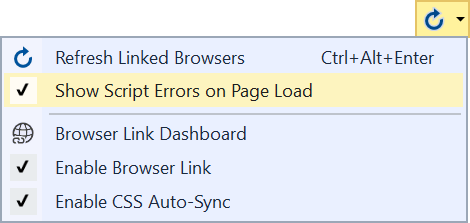
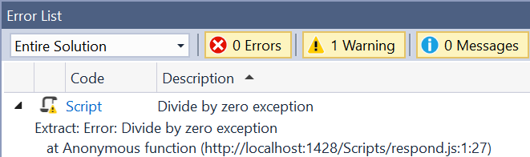

# Script Error

Download this extension from the [VS Marketplace](https://marketplace.visualstudio.com/items?itemName=MadsKristensen.W3CValidator)
or get the [CI build](http://vsixgallery.com/extension/5f8512da-c0df-4703-b72b-1d67315dd560/).

---------------------------------------

Detects any unhandled JavaScript errors from the running browser and shows them directly in the Visual Studio Error List.

See the [change log](CHANGELOG.md) for changes and road map.

## Features

- Run W3C validation on page load
- [Web Essentials Chrome extension](https://chrome.google.com/webstore/detail/web-essentials/mghdcdlpcdiodelbplncnodiiadljhhk) support
- Errors show up directly in the Visual Studio Error List

### Run on page load
By default, the validator runs when any ASP.NET generated page is loaded in the browser. That can be controlled from the Browser Link context menu on the *Standard* toolbar.

### Error List
Errors show up in the Error List inside Visual Studio after running the script error checker.

## Contribute
Check out the [contribution guidelines](.github/CONTRIBUTING.md)
if you want to contribute to this project.

For cloning and building this project yourself, make sure
to install the
[Extensibility Tools](https://visualstudiogallery.msdn.microsoft.com/ab39a092-1343-46e2-b0f1-6a3f91155aa6)
extension for Visual Studio which enables some features
used by this project.

## License
[Apache 2.0](LICENSE)